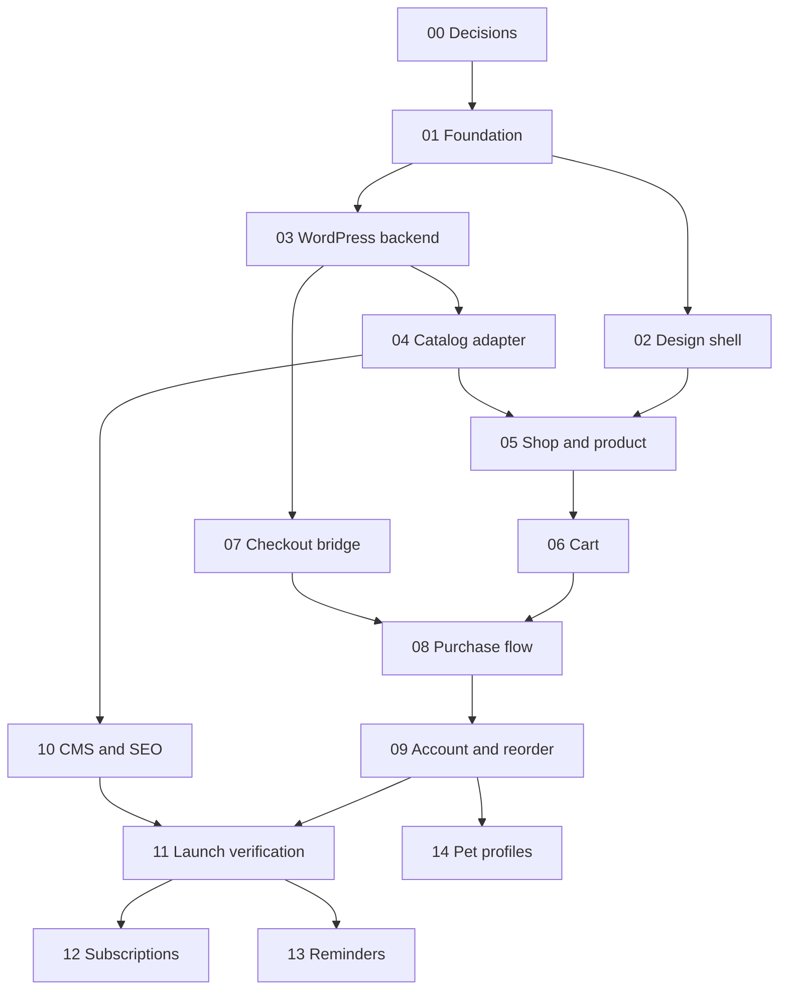

# Build Plan

## Workflow
Select a node whose dependencies pass. Read its brief. Write a short implementation plan. Implement the smallest complete slice. Run its meaningful checks. Fix failures and rerun affected checks. Record changed files, commands, actual outcomes and unresolved blockers in STATUS.md. Only then move to a dependent node. Continue independent nodes while waiting for external configuration.

## Dependency map

## Releases
A: Nodes 00–05. Browsable demo with labelled sample data; no working purchase claim.
B: Nodes 06–11. Real staging catalog and verified sandbox purchase; production only after business configuration.
C: Nodes 12–14. Optional retention features, individually gated.

## Important gates
A real staging WordPress installation is required to mark Node 03 PASS. Cart unit tests alone do not complete Node 06. Handoff must preserve actual variation IDs and coupons to complete Node 07. A recorded sandbox transaction and matching backend order complete Node 08. Country/provider/domain/catalog approval are launch blockers, not blockers to building the frontend.

Do not estimate calendar dates without catalog size, hosting access, integrations and team capacity. Paid plugins are optional decisions; no purchases are authorized by this brief.
